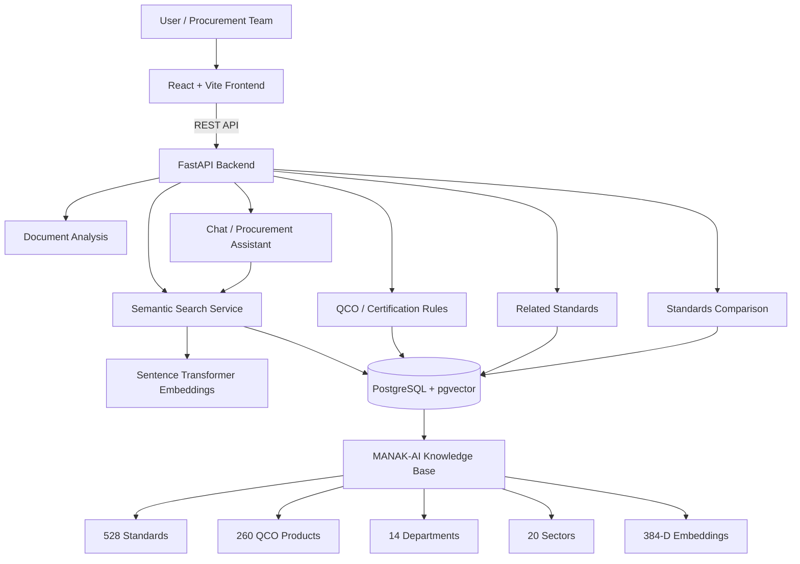

[README.md](https://github.com/user-attachments/files/32801972/README.md)
# MANAK-AI

> AI-powered recommendation engine for identifying applicable Indian Standards (IS) and related QCO/certification requirements from procurement specifications.

MANAK-AI is a full-stack web application designed to help procurement teams, engineers, and other users discover relevant Bureau of Indian Standards (BIS) standards from natural-language procurement requirements. It combines semantic/vector search, reranking, evidence-backed results, document analysis, QCO checks, standards comparison, related-standard discovery, and a conversational procurement assistant.

## Problem

Procurement specifications can contain long, technical descriptions that make it difficult to determine which Indian Standards are applicable. Manually searching standards and checking related regulatory requirements can be time-consuming and can lead to missed or weak matches.

MANAK-AI provides a single workflow for:

- Searching for relevant Indian Standards using natural-language specifications.
- Analyzing procurement documents and extracting relevant standards.
- Checking configured QCO/certification rules for products.
- Viewing detailed information for a standard.
- Comparing multiple standards.
- Finding related standards.
- Asking a conversational assistant about standards and procurement specifications.
- Presenting evidence and relevance information with recommendations.

## Key Features

### 1. Semantic Standard Search

Users can submit natural-language procurement requirements instead of relying only on exact keyword matching.

The backend uses:

- Sentence-transformer embeddings.
- PostgreSQL with pgvector.
- Vector similarity retrieval.
- Candidate reranking.
- Configurable relevance thresholds.
- Top-K candidate and final-result limits.

The current configuration uses `all-MiniLM-L6-v2` with 384-dimensional embeddings.

### 2. Procurement Document Analysis

Users can upload procurement documents in:

- PDF
- DOCX
- TXT

The backend extracts text and can analyze long documents using overlapping chunks before retrieving relevant standards.

The configured upload limit is 15 MB.

### 3. QCO / Certification Checks

MANAK-AI includes a rules-based certification/QCO lookup workflow.

It can return information such as:

- Product name.
- Applicable IS number.
- Whether the configured QCO rule is mandatory.
- Enforcement date.
- Product aliases.

The project also exposes a QCO listing endpoint with product categories and associated standards.

### 4. Standard Details

A standard can be opened by its IS number to retrieve information including:

- Title.
- Category and sub-category.
- Scope.
- Specifications.
- Normative references.
- QCO information.
- Version.
- Amendment information.
- Department and sector.
- Keywords and description.
- Source/provenance fields.
- Related standards.

Normative references can also be resolved by the backend.

### 5. Standards Comparison

The backend supports comparing multiple IS numbers and returning their stored standard information together.

### 6. Related Standards

Related standards can be computed using shared normative references and co-occurrence information.

### 7. Conversational Procurement Assistant

MANAK-AI includes a chat workflow backed by the project's retrieval and recommendation services.

The chat endpoint accepts a message, optional session/history information, and language information, and returns grounded structured information such as recommendations, QCO rules, related standards, and evidence.

### 8. Multilingual UI

The frontend contains localization resources for:

- English
- Hindi
- Marathi
- Kannada
- Tamil

### 9. Evidence-Oriented Results

The backend is designed around evidence-backed recommendations rather than returning only an unexplained standard number. Search and chat services expose structured recommendation and evidence information to the frontend.

### 10. Seeded Knowledge Base

The repository contains a precomputed knowledge base and embedding data so the application can initialize its database from the project data files.

## System Architecture



## Search / Retrieval Flow

```text
User Query
    |
    v
Frontend
    |
    v
FastAPI /api/search
    |
    v
Query Embedding
    |
    v
PostgreSQL + pgvector
    |
    v
Vector Candidate Retrieval
    |
    v
Reranking / Relevance Processing
    |
    v
Abstention Threshold
    |
    v
Final Top Results
    |
    v
Frontend Results + Evidence
```

For long procurement documents, the backend can additionally:

```text
Document
   |
   v
Text Extraction
   |
   v
Overlapping Chunking
   |
   v
Per-Chunk Retrieval
   |
   v
Deduplication / Best-Score Selection
   |
   v
Final Ranked Standards
```

## Knowledge Base

The current repository metadata describes the following knowledge base:

| Resource | Current value |
|---|---:|
| Indian Standards | 528 |
| QCO / certification products | 260 |
| Departments | 14 |
| Sectors | 20 |
| Embedding dimensions | 384 |
| Embedding model | `all-MiniLM-L6-v2` |
| Knowledge-base version | 2.5.0 |

The primary data files are stored under `backend/data/`.

Important files include:

```text
backend/data/
├── standards.json
├── standards.csv
├── certification_rules.json
├── qco_mapping.json
├── qco_mapping.csv
├── embeddings.json
├── departments.json
├── synonyms.json
├── related_standards.json
└── metadata.json
```

## Technology Stack

### Frontend

- React 18
- Vite 5
- React Router
- Tailwind CSS
- Lucide React
- JavaScript / JSX

### Backend

- Python
- FastAPI
- Uvicorn
- Pydantic
- psycopg2
- pgvector
- Sentence Transformers

### Document Processing

- pypdf
- python-docx
- python-multipart

### Database

- PostgreSQL 16
- pgvector

### Infrastructure

- Docker
- Docker Compose
- Render configuration

## Project Structure

```text
manak-ai/
│
├── backend/
│   ├── app/
│   │   ├── api/
│   │   ├── core/
│   │   ├── evidence/
│   │   ├── retrieval/
│   │   ├── rules/
│   │   ├── schemas/
│   │   └── services/
│   │
│   ├── data/
│   │   ├── standards.json
│   │   ├── certification_rules.json
│   │   ├── embeddings.json
│   │   └── ...
│   │
│   ├── scripts/
│   ├── tests/
│   ├── Dockerfile
│   └── requirements.txt
│
├── public/
│   └── favicon.png
│
├── sample-documents/
│   └── procurement examples
│
├── src/
│   ├── components/
│   ├── context/
│   ├── data/
│   ├── locales/
│   ├── pages/
│   ├── services/
│   ├── App.jsx
│   └── main.jsx
│
├── docker-compose.yml
├── render.yaml
├── package.json
├── vite.config.js
├── tailwind.config.js
└── README.md
```

## API Overview

The backend exposes its API under `/api`.

Important endpoints include:

| Endpoint | Purpose |
|---|---|
| `GET /api/health` | Backend health check |
| `POST /api/search` | Natural-language standard search |
| `POST /api/search/document` | Search from uploaded PDF/DOCX/TXT |
| `GET /api/standards/{is_number}` | Standard details |
| `GET /api/standards/{is_number}/related` | Related standards |
| `GET /api/standards/compare` | Compare standards |
| `POST /api/standards/compare` | Compare standards |
| `GET /api/qco/list` | List configured QCO rules |
| `POST /api/certification-check` | Product certification/QCO lookup |
| `POST /api/qco-check` | QCO checking workflow |
| `POST /api/chat` | Conversational procurement assistant |

## Local Development

### Prerequisites

Install:

- Node.js
- Python 3.x
- PostgreSQL with pgvector, or Docker Desktop

Docker is the simplest way to start the project's PostgreSQL + pgvector environment.

### Option A: Docker Compose

From the project root:

```bash
docker compose up --build
```

The compose configuration starts:

- PostgreSQL + pgvector
- FastAPI backend
- Vite frontend

Expected local services:

```text
Frontend: http://localhost:5173
Backend:  http://localhost:8000
Health:   http://localhost:8000/api/health
```

### Option B: Run the frontend separately

Install dependencies:

```bash
npm install
```

Start Vite:

```bash
npm run dev
```

### Run the backend separately

Create a virtual environment:

```bash
cd backend
python -m venv .venv
```

Windows:

```powershell
.venv\Scripts\activate
```

Linux/macOS:

```bash
source .venv/bin/activate
```

Install dependencies:

```bash
pip install -r requirements.txt
```

Start FastAPI:

```bash
python -m uvicorn app.main:app --reload --port 8000
```

The backend initializes the database/knowledge base through the project's seed workflow on application startup.

## Environment Variables

Do not commit secrets or local credentials to Git.

The application supports environment variables including:

```env
DATABASE_URL=postgresql://...
EMBEDDING_MODEL=all-MiniLM-L6-v2
EMBEDDING_DIM=384
ABSTAIN_THRESHOLD=40
VECTOR_TOP_K=20
FINAL_TOP_K=5
DOC_MAX_CHUNKS=24
DOC_CHUNK_SIZE=1500
DOC_CHUNK_OVERLAP=250
CORS_ORIGINS=*
```

Create a local `.env` file where appropriate and keep it out of Git.

## Docker Architecture

The repository includes a `docker-compose.yml` with three services:

```text
frontend
   |
   v
backend
   |
   v
PostgreSQL + pgvector
```

The PostgreSQL service uses the `pgvector/pgvector:pg16` image.

The backend receives its database connection through `DATABASE_URL`.

## Deployment

The repository contains a `render.yaml` describing a Render deployment with:

- A PostgreSQL 16 database.
- A Docker-based FastAPI backend.
- A static React/Vite frontend.
- Frontend `/api/*` rewrites to the backend service.
- Backend health checks through `/api/health`.

The configured deployment architecture is:

```text
                    Render
                      |
          ┌───────────┴───────────┐
          |                       |
          v                       v
   Static Frontend          FastAPI Backend
                                  |
                                  v
                         PostgreSQL + pgvector
```

Before deploying to production:

1. Configure production environment variables.
2. Do not commit `.env` files or credentials.
3. Verify the database connection.
4. Verify `/api/health`.
5. Verify the frontend API target.
6. Test semantic search.
7. Test QCO checks.
8. Test document uploads.
9. Test chat.
10. Verify CORS configuration for the deployed frontend domain.

## Screenshots

Add project screenshots to:

```text
screenshots/
```

Recommended screenshots:

```text
screenshots/
├── dashboard.png
├── search-results.png
├── qco-checker.png
├── standard-details.png
├── document-analysis.png
└── chat.png
```

Then reference them here:

### Dashboard


### Search Results


### QCO Checker


### Standard Details


### Document Analysis


### Chat


> The screenshot files are placeholders for repository documentation. Add the actual screenshots after capturing the current application UI.

## Testing

Backend tests are located in:

```text
backend/tests/
```

They cover areas including:

- Chat behavior.
- Document-analysis coverage.
- Knowledge-base expansion.
- Retrieval pipeline.
- PostgreSQL alignment.
- Reranking.
- API routes.
- Sector/QCO filtering.

Run the test suite from the backend environment with:

```bash
pytest
```

## Frontend Build

Create a production frontend build with:

```bash
npm run build
```

Preview the production build locally with:

```bash
npm run preview
```

## Data and Provenance

The repository contains a precomputed BIS-oriented knowledge base and metadata describing its provenance.

The current metadata identifies the knowledge base as:

`MANAK-AI BIS Standards Knowledge Base`

with provenance recorded as:

`Bureau of Indian Standards Official Gazette & Technical Division Specifications`

The repository should be treated as a project knowledge base and not as a substitute for checking the latest official BIS publication or applicable legal/regulatory notice before making a real procurement or compliance decision.

## Security Notes

Never commit:

- `.env`
- API keys
- access tokens
- passwords
- private credentials
- production database credentials

The repository's `.gitignore` excludes environment files and generated local dependencies/caches.

Before production deployment, replace development credentials and review CORS and database access configuration.

## Current Status

MANAK-AI is structured as a full-stack prototype with:

- React/Vite frontend.
- FastAPI backend.
- PostgreSQL + pgvector integration.
- Semantic retrieval and reranking.
- BIS standards knowledge base.
- QCO/certification rule workflows.
- Procurement document analysis.
- Conversational assistant.
- Standards comparison and related-standard workflows.
- Docker-based local infrastructure.
- Render deployment configuration.

## Future Scope

Potential future improvements include:

- Larger and continuously maintained standards corpus.
- More comprehensive regulatory/QCO coverage.
- Stronger document clause extraction.
- Improved retrieval evaluation and benchmark datasets.
- Role-based access and authentication.
- Production observability and logging.
- Automated knowledge-base refresh pipelines.
- More granular source citation and document provenance.
- Additional Indian-language support.

## Repository

GitHub:

https://github.com/sheel008/manak-ai

## License

Add the project's intended license here before public distribution.
